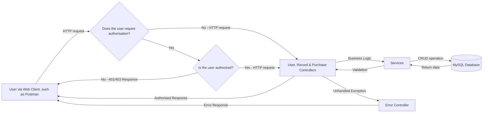
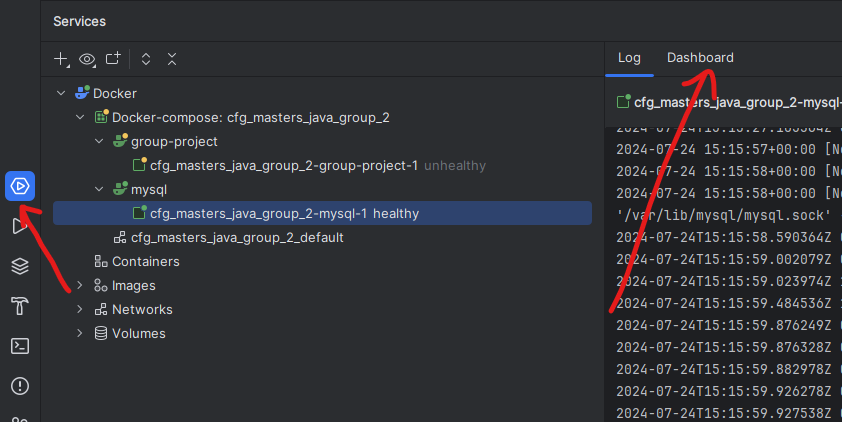

# Record Shop Security Project 🔒 ➡️ 🔐 ➡️ 🔓 ➡️ 💿 

This project is a Spring MVC RESTful API. The app manages stock, purchases and users for a fictional record shop. It consists of three main entities: `User`, `Purchase` and `Record`, each mapped to corresponding database tables by JPA. 

The project fully integrates modern security techniques offered through Spring Security, including password hashing and salting, HTTPS, JWT tokens, CSRF tokens and CORS. As such, certain endpoints require users to be authenticated and hold certain roles in order to make successful HTTP requests. 

# Project structure: 



# Endpoints: 

The application has the following endpoints: 

| Endpoint  | Method | Authorisation Required? | User role | Description | Returns | 
|-----------|--------| ---|----|-----| -----|
| "/login"  | POST   |  No | n/a | Expects a request body of username and password, which it validates against the database | If authenticated, Ok and a JWT token as a cookie and body message. If not authenticated, Forbidden.  |
| "/register" | POST | No | n/a | Expects a request body of firstname, lastname, username, password and role. | If all input validated and username is not in use, creates a new user and returns Ok |
| "/" | GET | No | n/a | Home route | Returns "Welcome to the Record Shop" message | 
| "/auth/records" | GET | Yes | Any| Requires valid JWT token, and optional params of artist or album to search | An authorised response will return a list of artist and albums matching the search params. No params will return a list of all records. Also returns CSRF token. |
| "/auth/getPurchases" | GET | Yes | Any| Requires valid JWT token | Returns a list of all purchases. Also returns CSRF token. | 
| "/auth/deletePurchase" | DELETE | Yes | ADMIN | Requires valid JWT and CSRF token and id parameter | An authorised request will delete record with the matching id and return No Content". |
| "/auth/purchase" | POST | Yes | Any | Requires valid JWT and CSRF token and body object containing customer name, record id and discount code | Authorised valid request returns Ok. | 


## Prerequisites

Before you begin, please ensure you have the following:

- Java Development Kit (JDK) 17 or higher
- The latest version of Maven
- An SQL database (e.g., MySQL)
- IntelliJ Community / Ultimate


## Setup Instructions

1. **Clone the repository**.


2. **Ensure the proper dependencies are installed. Please refer to `pom.xml` in the file for your reference**
    - Spring Boot Starter Data JPA
    - Spring Boot Starter Web 
    - Spring Boot Starter Test 
    - Flyway Core 
    - Flyway MySQL
    - MySQL Connector-J
    - Spring Security
    - JJWT-Api
    - JJWT-Impl
    - JJWT - Jackson Extension
    - Flyway Maven 
    - OpenAPI
    - Spring Mock MVC (Rest Assured)
    - Java Servlet API

   
3. **Ensure the proper plugins are installed. Please refer to `pom.xml` in the file for your reference**
    - JaCoCo Maven Plugin
    - Maven Surefire Plugin
    - Spring Boot Maven plugin
    - Lombok plugin 


4. **Configure the database**:
    - Go to your IntelliJ configuration
    - Navigate to [GroupProjectApplication](src/main/java/com/example/group/project/GroupProjectApplication.java), and edit the configuration to add in a new environment variable `MYSQL_ROOT_PASSWORD` and set it to your password for your database. For example `MYSQL_ROOT_PASSWORD="your password"`
    - Navigate to [GroupProjectApplicationTests](src/test/java/com/example/group/project/GroupProjectApplicationTests.java) and add in a new environment variable "MY_SQL_PASSWORD" and set it to your password for your database. For example `MYSQL_ROOT_PASSWORD="your password"`
    - Then run [GroupProjectApplication](src/main/java/com/example/group/project/GroupProjectApplication.java)
    - The Flyway integration should automatically create the database and migrate the relevant files to create and populate the tables.

5. **Debugging:**
    - Should you have any issue with the Flyway integration, you can manually create the database by running the MySQL script found in resources/db/migration 
    - You should remove Flyway Core, FlywaySQL and Flyway Maven from your pom.xml (please note: should you wish to run the docker file, you will need to replace these dependencies)
    - Please add the following lines of codes at the start before running on your preferred platform:

``` 
CREATE DATABASE IF NOT EXISTS recordShop;
USE recordShop;
```

6. **Generate SSL certificates**

- Run the following commands on your terminal providing the information prompted where relevant. Be sure to make note of your password. 

```
keytool -genkeypair -alias baeldung -keyalg RSA -keysize 2048 -storetype PKCS12 -keystore baeldung.p12 -validity 3650
```
- This will generate SSL certificates. Save these in `src/resources/certs`. You should be sure to add these to your .gitignore
- Save your password for the certificates as an environment variable named `KEYSTORE_PASSWORD` 


## How to Run the Application

1. **Start the application**:
    In the project's root directory, run [GroupProjectApplication](src/main/java/com/example/group/project/GroupProjectApplication.java)

2. **API Endpoints**:

Once the application is running, you can explore unauthorised endpoints freely and authorised with the correct credentials. We suggest using the following flow:

> 💡 Import our pre-made Postman collection to run the following the series of requests. [You can download them here](https://github.com/Rachel-Tookey/RecordShop_Security_Project/blob/fe08dd0bfad1723fd63579f945cb234a015084ec/documentation/postman/recordshop.postman_collection.json).


| Endpoint URL | Method | Example Request | Expected Response |
| :-------- | :--------| :----------- | :---------|
| /auth/records | GET | - | 403 Forbidden. | |
| /login | POST |`{"username":GillyT10","password":"goodbye"}` | 200. Bearer token in body response. |
| /auth/records <br/>  /auth/records?artist={ARTISTNAME}&name={ALBUM} | GET | Authorization with Bearer token provided. <br/> Optional params or artist and album. | 200. List of records. X-XSRF-TOKEN returned as cookie and header |
| /auth/purchase | POST | Authorization Header: JWT token <br/>  Custom header X-XSRF-TOKEN with X-XSRF token <br/> Body: `{"customer" : "john","id" : 1, "discount" : "cfg"}` | 200. Purchase Id in response. |
| /auth/deletePurchase?id=1 | DELETE | Authorization Header: JWT token; Custom header X-XSRF-TOKEN with X-XSRF token; Param id=1 | 204 No content | https://localhost:8443/register | POST | Body: <br/>  `{ "firstname" : "john","lastname" : "kelly299","username" : "john100","password" : "password123", "role" : "STAFF"}` | 200. New User | 
| /login | POST | `{"username" : "john100","password" : "password"}` | 200. Bearer token in body response. |
| /auth/records <br/>  /auth/records?artist={ARTISTNAME}&name={ALBUM} | GET | Authorization with Bearer token provided. <br/> Optional params or artist and album. | 200. List of records. X-XSRF-TOKEN returned as cookie and header |
| /auth/purchase | POST | Authorization Header: JWT token <br/> Custom header X-XSRF-TOKEN with X-XSRF token <br/>  Body: `{"customer" : "john","id" : 1, "discount" : "cfg"}` | 409 Conflict. Item not in stock. |
| /auth/deletePurchase?id=2 | DELETE | Authorization Header: JWT token <br/> Custom header X-XSRF-TOKEN with X-XSRF token <br/> Param id=2 | 403 Forbidden |


---

### API Spec:

This will help in generating interactive API documentation in order to test the API calls. Please see Open API: [here](https://localhost:8443/swagger-ui/index.html).

### Documentation:

Located [here](https://github.com/Tookles/cfg_mastersplus_java_group_two/blob/ef228c984a4ed05e0d5931792c5eec2568af15f2/documentation)

Quick links: 

- [Overview](https://github.com/Tookles/cfg_mastersplus_java_group_two/blob/34be0409e72a8b0aed221af52bd3fefd1dafd8ff/documentation/overview/overview.md)
- [Requirements plan](https://github.com/Tookles/cfg_mastersplus_java_group_two/blob/9f56401b24901530be67468dbf6873d72fc1a287/documentation/plans/requirementsPlan.md)
- [User stories](https://github.com/Tookles/cfg_mastersplus_java_group_two/blob/9f56401b24901530be67468dbf6873d72fc1a287/documentation/stories/userStories.md)
- [Manual Test Plan](https://github.com/Tookles/cfg_mastersplus_java_group_two/blob/ef228c984a4ed05e0d5931792c5eec2568af15f2/documentation/testplan/manualTestPlan.md) and [further test resources](https://github.com/Tookles/cfg_mastersplus_java_group_two/blob/9f56401b24901530be67468dbf6873d72fc1a287/documentation/testplan/getPostTestingFabi.md)
- [Deployment plan](https://github.com/Tookles/cfg_mastersplus_java_group_two/blob/1a371f9224423dcd1e1a7b777dfe01aecacdea00/documentation/plans/deploymentPlan.md)

---

## Docker Instructions:

To follow these instructions you have to have Docker Desktop installed on your machine.

1. Start docker engine by opening Docker Desktop (or start it from IntelliJ)
2. Insert your MySQL user password in the terminal
   - bash terminal: `export MYSQL_ROOT_PASSWORD=your_password_here`
   - command prompt: `$env:MYSQL_ROOT_PASSWORD = "your_password_here"`
3. Run the command to build the docker containers: `docker compose up --build`
4. Check if the app is running by visiting http://localhost:8080/records. You should see the list of records from the database.
5. Once your docker container is running, you can use Postman or a similar API tool to explore the application as described [here](#how-to-run-the-application).

### NOTE
   Should you have an issue when exporting your password you can try the following:

   **MAC USERS**

   In the terminal run the command `MYSQL_ROOT_PASSWORD=yourMySQLpassword docker compose up --build` using your own password instead of "yourMySQLpassword".

   **WINDOWS USERS**
   - In the terminal run the command `docker compose up --build`.
   - Click on the Services to see your docker containers
   - Select **mysql** container and click on Dashboard. Insert your personal MySQL password for the environment variable called MYSQL_ROOT_PASSWORD.

   

---

## "Pipeline" or maven.yml:

- Should you wish to test the Github Actions maven.yml file, you should fork the repository 
- Set up a [Github secret](https://docs.github.com/en/actions/security-guides/using-secrets-in-github-actions) with your MySQL root password with variable name "MY_SQL_PASSWORD"
- Trigger the workflow through a push or pull request to main 

___

### Further development: 

- Develop frontend with React


### Developers + Github profiles:

- [Rachel](https://github.com/Rachel-Tookey)
- [Fabiola](https://github.com/Fabi-P)
- [Alyssa](https://github.com/lyscodes)

