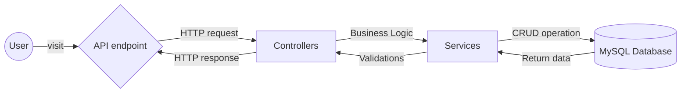

# GROUP 2 PROJECT
## Record Shop Database App



## Introduction

This project is a Spring Boot application that manages purchases and records of a music shop that sells vinyls. It utilizes JPA for database interactions and Lombok to reduce boilerplate code. The application consists of two main entities: `Purchase` and `Record`, each mapped to corresponding database tables.

The application should have the following:

| Functionality  | Description                                     |
|----------------|-------------------------------------------------|
| **Inserting**  | Add purchases to the `purchases` table          |
| **Updating**   | Update the quantity of records after a purchase |
| **Retrieving** | Find specific record by name                    |
|                | Get list of records by artist                   |
|                | Find record by name and artist                  |


---

## Prerequisites

Before you begin, please ensure you have the following:

- Java Development Kit (JDK) 17 or higher
- The latest version of Maven
- An SQL database (e.g., MySQL)
- IntelliJ Community / Ultimate

---

## Setup Instructions

1. **Clone the repository**.


2. **Ensure the proper dependencies are installed. Please refer to `pom.xml` in the file for your reference**
    - Spring Boot Starter Data JPA
    - Spring Boot Starter Web 
    - Spring Boot Starter Test 
    - Flyway Core 
    - Flyway MySQL
    - MySQL Connector/J
    - Lombok 
    - Flyway Maven 
    - OpenAPI
    - Spring Mock MVC (Rest Assured)

   
3. **Ensure the proper plugins are installed. Please refer to `pom.xml` in the file for your reference**
    - JaCoCo Maven Plugin
    - Maven Surefire Plugin
    - Spring Boot Maven plugin 


4. **Configure the database**:
    - Go to your IntelliJ configuration
    - Navigate to [GroupProjectApplication](src/main/java/com/example/group/project/GroupProjectApplication.java), and edit the configuration to add in a new environment variable `MYSQL_ROOT_PASSWORD` and set it to your password for your database. For example `MYSQL_ROOT_PASSWORD="your password"`
    - Navigate to [GroupProjectApplicationTests](src/test/java/com/example/group/project/GroupProjectApplicationTests.java) and add in a new environment variable "MY_SQL_PASSWORD" and set it to your password for your database. For example `MYSQL_ROOT_PASSWORD="your password"`
    - Then run [GroupProjectApplication](src/main/java/com/example/group/project/GroupProjectApplication.java)
    - The Flyway integration should automatically create the database and migrate the relevant files to create and populate the tables.


5. **Debugging:**
    - Should you have any issue with the Flyway integration, you can manually create the database by running the MySQL script found in resources/db/migration 
    - You should remove Flyway Core, FlywaySQL and Flyway Maven from your pom.xml (please note: should you wish to run the docker file, you will need to replace these dependencies)
    - Please add the following lines of codes at the start before running on your preferred platform:

``` 
CREATE DATABASE IF NOT EXISTS recordShop;
USE recordShop;

```

---

## How to Run the Application

1. **Start the application**:
    In the project's root directory, run [GroupProjectApplication](src/main/java/com/example/group/project/GroupProjectApplication.java)

2. **API Endpoints**:

    Once the application is running, you can access the following endpoints:

    | Endpoint URL                                                     | Method | Description                                                                                                                                                                           | Example Request                                                           |
    |------------------------------------------------------------------|--------|---------------------------------------------------------------------------------------------------------------------------------------------------------------------------------------|---------------------------------------------------------------------------|
    | `http://localhost:8080/purchase`                                 | POST   | Endpoint to make a purchase.<br><br>**Please note:** Discount is optional, and the customer field must contain more than two characters.                                              | ```{"customer": "John",```<br>```"id": 3,```<br>```"discount": "CFG" }``` |
    | `http://localhost:8080/records?artist={ARTISTNAME}&name={ALBUM}` | GET    | Endpoint to retrieve the information on the records in the database. **Please note**: both artist and name of the record can be excluded to retrieve a list of all records available. | http://localhost:8080/records?artist=Michael%20Jackson&name=Thriller      |

---

### API Spec:

This will help in generating interactive API documentation in order to test the API calls. Please see Open API: [here](http://localhost:8080/swagger-ui/index.html).

### Documentation:

Located [here](https://github.com/Tookles/cfg_mastersplus_java_group_two/tree/main/documentation)

Quick links: 

- [Overview](/Users/racheltookey/Desktop/Java/group_project_folder/group-project/documentation/overview/overview.md)
- [Requirements plan](/Users/racheltookey/Desktop/Java/group_project_folder/group-project/documentation/plans/requirementsPlan.md)
- [User stories](/Users/racheltookey/Desktop/Java/group_project_folder/group-project/documentation/stories/userStories.md)
- [Manual Test Plan](/Users/racheltookey/Desktop/Java/group_project_folder/group-project/documentation/testplan/manualTestPlan.md) and [further test resources](/Users/racheltookey/Desktop/Java/group_project_folder/group-project/documentation/testplan/getPostTestingFabi.md)
- [Deployment plan](/Users/racheltookey/Desktop/Java/group_project_folder/group-project/documentation/plans/deploymentPlan.md)

---

## Docker Instructions:

To follow these instructions you have to have Docker Desktop installed on your machine.

1. Start docker engine by opening Docker Desktop (or start it from IntelliJ)
2. Insert your MySQL user password in the terminal
   - bash terminal: `export MYSQL_ROOT_PASSWORD=your_password_here`
   - command prompt: `$env:MYSQL_ROOT_PASSWORD = "your_password_here"`
3. Run the command to build the docker containers: `docker compose up --build`
4. Check if the app is running by visiting http://localhost:8080/records. You should see the list of records from the database.
5. Once your docker container is running, you can use Postman or a similar API tool to explore the application as described [here](#how-to-run-the-application).

### NOTE
   Should you have an issue when exporting your password you can try the following:

   **MAC USERS**

   In the terminal run the command `MYSQL_ROOT_PASSWORD=yourMySQLpassword docker compose up --build` using your own password instead of "yourMySQLpassword".

   **WINDOWS USERS**
   - In the terminal run the command `docker compose up --build`.
   - Click on the Services to see your docker containers
   - Select **mysql** container and click on Dashboard. Insert your personal MySQL password for the environment variable called MYSQL_ROOT_PASSWORD.

   

---

## "Pipeline" or maven.yml:

- Should you wish to test the Github Actions maven.yml file, you should fork the repository 
- Set up a [Github secret](https://docs.github.com/en/actions/security-guides/using-secrets-in-github-actions) with your MySQL root password with variable name "MY_SQL_PASSWORD"
- Trigger the workflow through a push or pull request to main 

___

### Further development: 


- Use JSON Web Tokens and encryption when sending calls to the "/purchase" endpoint to ensure security
- Develop frontend through Thymeleaf template engine


### Developers + Github profiles:

- [Rachel](https://github.com/Tookles)
- [Fabiola](https://github.com/Fabi-P)
- [Alyssa](https://github.com/lyscodes)

---
### Notes to the Marker:


In the [test folder](src/test) you will find all the tests written.
[GroupProjectApplicationTests](src/test/java/com/example/group/project/GroupProjectApplicationTests.java) is the only test that uses `@SpringBootTest` annotation, as it is the only test that will check if the app context can successfully be loaded. For this reason ensure your MySQL server (or docker container) is running before running this test.
All other tests use Mockito to mock interactions with the database so they can be run without MySQL server running.
For further development, we would investigate using this on other test files and what other beans could be useful (i.e. Autowired)

